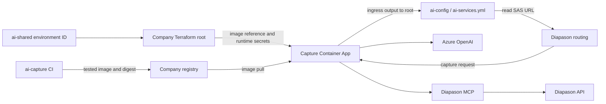

# Capture: Azure deployment handoff

Review date: 2026-09-16. This is a deployment design and readiness review, not a
record of a successful Azure deployment. The edit inventory is in
[AZURE_DEPLOYMENT_CHANGES.md](AZURE_DEPLOYMENT_CHANGES.md).

## The concrete link between this repository and Azure

**No new Python configuration loader is needed. Deployment wiring is still needed.**
The current code already supports local files and ACA environment variables, but
the company Terraform module/pipeline that supplies those variables has not been
implemented in the provided context. Creating a folder named `apps/ai/ai-capture`
does not automatically connect Terraform to this repository.

There are two things to deliver to ACA:

1. **The application image.** A CI runner checks out `ai-capture`, builds its
   existing `Dockerfile`, and pushes the image to the company registry. Terraform
   receives that image's full registry reference and sets it on an
   `azurerm_container_app` resource. Azure pulls the image and starts the command
   already in the Dockerfile: `uvicorn capture.asgi:app` on port 8000. The build
   runs on a CI/build runner; no Docker installation on the developer workstation
   is required. See [ACA containers](https://learn.microsoft.com/en-us/azure/container-apps/containers).
2. **The runtime configuration.** The Terraform deployment supplies ACA secrets
   and environment-variable references. When Azure starts the container, Capture
   sees the resulting values in its process environment. The runtime does not
   read the Terraform repository or Terraform state.

The deployment equivalent of local setup is:

| Local development | Deployed ACA container |
| --- | --- |
| Copy `config.example.json` to `config.json`, then fill in values. | Prepare the same JSON structure with dev Azure values and store it as the complete `CHAT_CONFIG` secret. |
| `settings.py` reads local `config.json` when `CHAT_CONFIG` is absent. | ACA injects the JSON string into `CHAT_CONFIG`; `settings.py` reads and parses it. No `config.json` needs to exist in the image. |
| Local `jwt_keystore.p12` plus its password in `config.json`. | Base64 of the agreed PKCS#12 in `JWT_KEYSTORE_P12_B64`, with its matching password inside `CHAT_CONFIG.jwt.keystore_password`. |
| `config/catalog.json` and `config/prompts/` on disk. | The same `config/` content is already bundled in the image by the Dockerfile. This directory is separate from the secret `config.json` file. |

### Recommended first-dev setup: a complete JSON secret in Infisical

Use the existing whole-JSON configuration approach for the first deployment:

1. The Capture owner and infrastructure colleagues prepare the JSON using
   `config.example.json` as its schema. Keep Capture settings; fill in the Azure
   OpenAI endpoint/key/deployment, actual reachable MCP URL including `/mcp`, the
   existing MCP Fernet key, and the keystore password. This is an explicit setup
   step: Terraform does not automatically read the developer's local `config.json`.
2. An authorized secret administrator stores that entire JSON value in Infisical,
   in environment `dev`, proposed folder `/ai-capture`, secret name `CHAT_CONFIG`.
   Store the matching `JWT_KEYSTORE_P12_B64` there too. These names describe the
   proposed setup; this review has not created the folder or secrets.
3. The **company Terraform pipeline** authenticates to Infisical and retrieves
   these values using the company's chosen integration. It supplies sensitive
   Terraform root variables, for example `capture_chat_config` and
   `capture_jwt_keystore_p12_b64`. Those pipeline inputs must actually be wired;
   matching names in two systems do not transfer a value automatically.
4. The Terraform root passes the values to `apps/ai/ai-capture` as
   `chat_config_json` and `jwt_keystore_p12_b64`. That module creates ACA secrets
   and connects them to the environment variables shown below.
5. ACA starts the image with those environment variables. Existing
   `settings.load_config()` parses `CHAT_CONFIG`; existing auth code reads the
   base64 keystore. No Infisical client or Terraform-aware code is added to Capture.

The JSON is therefore **prepared during environment setup, stored in Infisical,
and injected during deployment**. It is not built into the application image.
For dev/staging/prod, use environment-specific secret values with the same image.
Update the authoritative secret if a dependency endpoint or credential changes,
then redeploy/restart as described below.

Here is the exact value handoff, using proposed pipeline/root variable names:

| Stage | Name | Value |
| --- | --- | --- |
| Infisical `dev`, `/ai-capture` | `CHAT_CONFIG` | Complete JSON string with dev settings and credentials. |
| Terraform runner environment | `TF_VAR_capture_chat_config` | The same string, retrieved by the pipeline. |
| Terraform root variable | `var.capture_chat_config` | Sensitive string declared in the company Terraform root. |
| Capture module input | `chat_config_json = var.capture_chat_config` | Explicit root-to-module assignment. |
| ACA secret | `chat-config` | `var.chat_config_json` inside the module. |
| ACA container environment | `CHAT_CONFIG`, referencing `chat-config` | ACA exposes the secret's value, not the secret's name. |
| Existing application code | `json.loads(os.getenv("CHAT_CONFIG", "").strip())` | Parsed configuration used by Capture. |

`TF_VAR_...` is a supported way to supply Terraform root variables; the Infisical
retrieval remains a pipeline step, not something that prefix performs. See
[Terraform input variables](https://developer.hashicorp.com/terraform/language/values/variables)
and [ACA secret references](https://learn.microsoft.com/en-us/azure/container-apps/manage-secrets).
Use the equivalent handoff for the base64 keystore. The HCL fragments later in
this guide show the module-side secret and environment blocks.

Azure **resource IDs** such as the shared ACA environment ID are Terraform inputs.
Runtime **connection settings** such as the OpenAI HTTPS endpoint and MCP URL are
JSON fields. Terraform places Capture in the selected ACA environment; Capture
then connects to its dependencies using those URLs and credentials.

### What remains to edit here

For the recommended split, replace the inherited `deploy.yml`/`deploy.sh` path
with **image build and publish**, and retire local infrastructure deployment and
Blob uploads. Keep the existing Dockerfile and Python runtime. The image build
must run somewhere even if deployment is entirely owned by Terraform.

If colleagues also own an external image-build pipeline that checks out this
repository, a new build workflow here is optional. In that arrangement, retiring
the stale deployment entry points may be the only functional repository change.
The external image-build and secret-injection work still has to be implemented.
The complete Terraform resource/module belongs in their repository.

## Decision: keep the runtime, replace the inherited deployment path

For a first dev deployment, the existing Capture runtime can receive its settings
without a Python refactor. Supply the existing `CHAT_CONFIG` JSON and
`JWT_KEYSTORE_P12_B64` environment variables to its container. Keep the bundled
`config/` catalog and prompts in the image.

The necessary work is primarily deployment integration. The company Terraform
repository should own `apps/ai/ai-capture`, the Container App, its configuration,
and its integration with `ai-shared`. This application repository should build
and test the image and hand its immutable image reference to that repository.
Use `ai-capture` as the new app/image identity; do not repurpose the deployed
`diapason-agent` app or its state just to deploy Capture.

The provided `terraform_context.txt` was treated as reference material. Its
commands and migration instructions were not executed. The actual company
Terraform root, app modules, state, shared Actions implementation, and live Azure
resources were not available for inspection. All interfaces proposed below must
be adapted to that repository's conventions.

## What needs changing in this repository before deployment

These are planned changes, **not changes made by this review**.

| File | Observed behavior | Necessary deployment change |
| --- | --- | --- |
| [deploy/deploy.sh](deploy/deploy.sh) | Uses `/diapason-agent`, `IMAGE_NAME=diapason-agent`, and defaults the app to that image name. Calls `terraform_ensure_infra`, requires storage settings, builds a missing `frontend/`, and invokes missing `requirements.txt` and `test/test_agent_smoke.py`. | Replace with an image build/publish or central-pipeline handoff. Remove the local infrastructure apply, storage requirements, frontend build, registry pruning of the old image, and obsolete smoke invocation from Capture's deployment path. Setting only `APP_NAME=ai-capture` does not fix the other hardcoded values. |
| [.github/workflows/deploy.yml](.github/workflows/deploy.yml) | Manual dev/test and published-release prod triggers call that inherited script. | Before using deployment or publishing a release, disable the inherited deploy job or replace it with build/publish plus the company Terraform handoff. Preserve promotion of the same tested image, but let the central repository apply the app resource and image change. |
| [deploy/infra.tf](deploy/infra.tf) | Declares `diapason-agent`, `chat-sessions`, `agent-config`, Blob RBAC, and a generated `./.terraform-modules/aca_app` module. | Retire it from the executable Capture deployment path once central ownership is established. Do not copy its chat containers/RBAC into the Capture module. Remove/archive the file and its local provider lockfile together when the old entry point is retired. |
| [deploy/deploy-config.sh](deploy/deploy-config.sh) | Uploads `system_prompt.md` and `skills/intelligence_contract/config`, which are absent here. | Retire it with the old deployment path. Catalog/prompt changes already ship through the image. |
| [README.md](README.md) | Previously described the inherited deploy path as usable for Capture. | Corrected in this review; link to the eventual central pipeline when its interface exists. |
| [config.example.json](config.example.json) | Its MCP placeholder points to loopback port 8000, also Capture's default port. | Use the real MCP URL in local/runtime configuration. A later example-only correction to a separate port such as 8001 would avoid confusion; it is not an Azure runtime change. |
| [Dockerfile](Dockerfile), [pyproject.toml](pyproject.toml), [uv.lock](uv.lock), `src/`, `config/` | Already package Capture and bundled content without a frontend or active Blob persistence. | No mandatory change identified for the first dev deployment. Build the image on a CI runner and verify it in dev ACA; local Docker is not required. |

The shared `../actions/service-deploy/aca-lib.sh` and generated ACA module are
absent in this workspace. Their internal behavior is unknown; do not assume their
helpers support central Terraform ownership. The visible script is already
incompatible with this checkout independently of those helpers.

There is no need to rename `CHAT_CONFIG`, the `chat` JWT role, or issuer
`diapason-agent` for Azure. They remain compatibility contracts. Renaming the Azure
app does not require renaming these runtime/authentication values.

## Resource ownership and values to pass

| Resource or value | Owner/source | How Capture uses it |
| --- | --- | --- |
| Dev subscription and resource group | Company Terraform root/environment configuration | Provisioning inputs only; not Python settings. Use the dedicated dev resource group selected by the infrastructure team. |
| Container Apps environment | `ai-shared` output `id` | Pass as the Capture resource's `container_app_environment_id`. Do not create another environment in the Capture module. |
| App resource, ingress, probes, scaling | New `apps/ai/ai-capture` | Name `ai-capture`; container target port 8000; image from this repo. |
| Shared storage account, `ai-config` container and `ai-services.yml` | `ai-shared` plus company root | Diapason's route discovery. Capture has no runtime storage account/container input for this. |
| `AI_CONFIG_SERVICES_URL` SAS URL | Shared Terraform/Infisical `/ai-config` | Configure **Diapason** with `diapason.ai.config.url`. Do not add this secret to Capture. |
| Azure OpenAI endpoint and model deployment | Existing AI resource, or its future central module | `CHAT_CONFIG.azure_openai.endpoint` and `.deployment`. The supplied `ai-shared` does not provision either. |
| Azure OpenAI API key | Company secret source | `CHAT_CONFIG.azure_openai.api_key`. The deployment name is not the model family name unless the deployment was named that way. |
| Diapason MCP endpoint | Actual MCP app output | `CHAT_CONFIG.mcp.default.server_url`, including `/mcp` exactly once. |
| MCP Fernet key | Same secret as MCP's `MCP_CONFIG_KEY` | `CHAT_CONFIG.mcp.default.config_key`. Reuse the existing matching key for that environment. |
| PKCS#12 and password | Capture's agreed token issuance setup | Base64 bytes in `JWT_KEYSTORE_P12_B64`; matching password in `CHAT_CONFIG.jwt.keystore_password`. Callers must possess tokens signed by the matching key and accepted issuer. |
| Container registry and pull credentials | Existing company registry/secret source | ACA registry configuration, separate from application settings. Current workflow names `containers.diapason.ghe.com`; ACR is not a prerequisite. |
| OTLP destinations and authentication | Company observability setup | Supported `OTEL_*` variables; use `OTEL_SERVICE_NAME=ai-capture`. |

The supplied shared module does not show an OpenAI account/deployment, registry,
Key Vault, VNet/private endpoints, or an explicit Log Analytics workspace. Resolve
these from the company root or existing resources; their existence is not proven
by this context. A managed identity and Blob RBAC are not needed by the current
API-key-based Capture workflow. A future Key Vault or managed-identity integration
can introduce its own identity requirements.

Prefer passing the shared environment's full resource ID. Do not infer the
environment's resource group from the Capture app's group if the company chooses
to separate them. Region and connectivity must match the selected environment.

## Existing runtime configuration contract

[settings.py](src/capture/common/settings.py) reads nonempty `CHAT_CONFIG` before
local `config.json`, then caches it for the process lifetime. Its value must be a
JSON object, not a filename, SAS URL, or a map of Azure resource IDs. A malformed
value fails startup. Separate variables such as `CAPTURE_CONFIG` or
`AZURE_OPENAI_DEPLOYMENT` do not populate this JSON automatically.

Example shape, with placeholders to be resolved by the deployment/secret system:

```json
{
  "jwt": {
    "keystore_password": "<password matching the PKCS#12 secret>",
    "revoked": { "jtis": {}, "subs": {} }
  },
  "capture": {
    "enabled": true,
    "cache_ttl_seconds": 300,
    "max_pdf_bytes": 10485760,
    "view_entity": "loanDeposit",
    "temperature": 0.5
  },
  "azure_openai": {
    "endpoint": "https://<resource>.openai.azure.com/",
    "api_key": "<secret>",
    "deployment": "<existing model deployment name>",
    "api_version": "2024-10-21"
  },
  "mcp": {
    "default": {
      "server_url": "https://<actual-mcp-ingress-fqdn>/mcp",
      "config_key": "<same Fernet key as MCP_CONFIG_KEY>"
    }
  }
}
```

The API version above is the current project default, not a claim that every
future model supports it. Retain the working endpoint/version/deployment for dev;
validate the chosen model's Chat Completions and `temperature` support when changing
models. The current pipeline extracts PDF text with `pypdf`; it does not call an
Azure Document Intelligence/OCR resource.

Use a dedicated Infisical path such as `/ai-capture` for this service's configuration
and keystore. This path is a proposal, not an existing folder established by the
provided shared module. Terraform or its pipeline must bridge Infisical values to
ACA secrets; the Capture process does not fetch Infisical itself.

The concrete ACA mapping is:

| Container environment variable | ACA source |
| --- | --- |
| `PORT` | Plain value `8000` |
| `CHAT_CONFIG` | Secret reference `chat-config`, whose value is the JSON above |
| `JWT_KEYSTORE_P12_B64` | Secret reference `jwt-keystore-p12-b64` |
| `OTEL_SERVICE_NAME` | Plain value `ai-capture` |
| `OTEL_RESOURCE_ATTRIBUTES` | For example `deployment.environment=dev` |

For the Terraform author, these are **fragments** of an `azurerm_container_app`,
not a standalone module to apply from this repo:

```hcl
# At resource level; declare both input variables as sensitive strings.
secret {
  name  = "chat-config"
  value = var.chat_config_json
}
secret {
  name  = "jwt-keystore-p12-b64"
  value = var.jwt_keystore_p12_b64
}

# Inside template.container:
env {
  name        = "CHAT_CONFIG"
  secret_name = "chat-config"
}
env {
  name        = "JWT_KEYSTORE_P12_B64"
  secret_name = "jwt-keystore-p12-b64"
}
env {
  name  = "PORT"
  value = "8000"
}
```

Use `secret_name` in Terraform, not the Azure CLI string `secretref:...` as an
environment variable's literal value. These fields and the registry authentication
options are documented in the
[AzureRM Container App resource](https://github.com/hashicorp/terraform-provider-azurerm/blob/main/website/docs/r/container_app.html.markdown).
Validate against the company repository's locked provider version.

For the first dev deployment, the recommended source is the complete `CHAT_CONFIG`
JSON in Infisical described above. If the company later wants Terraform outputs
to update connection settings automatically, it can instead compose the JSON in
the central root with `jsonencode` from endpoint outputs and individual secret
inputs. In that alternative, the root constructs `chat_config_json`; Capture's
ACA environment-variable interface stays the same. Do not maintain two competing
JSON sources, or publish application credentials into `ai-services.yml`.

Direct Terraform secret values are stored in state even when marked `sensitive`;
use the company's protected state backend. If the company later supplies Key
Vault references, ACA can still expose the same environment variables without a
Capture code change. That option needs identity/access configuration and is not
provided by the shared snippet. See
[Terraform sensitive data](https://developer.hashicorp.com/terraform/language/manage-sensitive-data)
and [ACA secrets](https://learn.microsoft.com/en-us/azure/container-apps/manage-secrets).

With directly managed ACA secret values, a secret update alone does not create a
new revision or refresh running processes. Plan a new revision or restart after
configuration/key rotation. Capture's prompt refresh endpoint does not reload
`CHAT_CONFIG`. Versionless Key Vault references have their own automatic refresh
behavior. See [ACA secret updates](https://learn.microsoft.com/en-us/azure/container-apps/manage-secrets).

For OTLP, the current implementation uses HTTP exporters and passes endpoint URLs
as-is. Prefer full `OTEL_EXPORTER_OTLP_TRACES_ENDPOINT` and
`OTEL_EXPORTER_OTLP_LOGS_ENDPOINT` signal URLs. Authentication can use
`OTEL_EXPORTER_OTLP_HEADERS`, logs-specific headers, or the implemented
`OTEL_EXPORTER_OTLP_TOKEN` fallback; keep authentication values in secrets. Retain
existing logger names initially and distinguish the service with `OTEL_SERVICE_NAME`.
See [telemetry.py](src/capture/common/telemetry.py).

## Proposed central module interface and release flow

Agree this interface before rewriting the local deployment workflow:

| Proposed input/output | Required value or behavior |
| --- | --- |
| Input `resource_group_name` | Selected Capture dev resource group. |
| Input `container_app_environment_id` | `module.ai_shared.id` or equivalent root reference. |
| Input `image_ref` | Full published Capture image reference, preferably registry digest. |
| Inputs `registry_server`, `registry_username`, `registry_password` | Company registry access; password sensitive. For GHE, use registry credentials, not Azure identity alone. |
| Inputs `chat_config_json`, `jwt_keystore_p12_b64` | Sensitive values resolved by the central pipeline, or the company's equivalent secret-reference contract. |
| Inputs for ingress, resources, replicas, tags, OTEL | Owned explicitly by the central module. Start dev with single revision mode, one replica, and a measured resource allocation; 0.5 vCPU / 1 GiB is a starting candidate, not a measured requirement. |
| Output `id` | Actual app resource ID. |
| Output `base_url` | Stable app ingress URL: `https://${azurerm_container_app.this.ingress[0].fqdn}`. Do not use the revision-specific hostname. |

The company root should consume `base_url` as the existing `capture_url` template
input. Use actual MCP ingress output for `mcp_url`, respecting that the supplied
template already appends `/mcp`. Capture's own JSON needs the complete MCP URL.



Build once with `APP_VERSION` from `VERSION` and `GIT_REVISION` from the source
commit; push the Capture image; pass its digest/tag, version, and commit to the
central pipeline. The root applies the app, renders the route map after app
outputs exist, then runs the checks below. Promotion and rollback select an
existing image through that same Terraform owner. Avoid a second pipeline doing
`az containerapp update` on the same Terraform-managed image/template.

Environment names need an explicit decision: the existing app workflow uses
`dev|test|prod`, while the provided shared Terraform validates `dev|staging|prod`.
Dev is aligned. Before promotion, choose one name or an explicit mapping across
GitHub environments, Infisical slugs, Terraform variables/state, and resource names.

For a **new** Capture app, no transfer of old agent resources is necessary. If any
resource is already managed by an older state, the Terraform owners must coordinate
its transfer/import before another state claims it. Do not run a destroy or remove
legacy chat containers as part of this Capture work; other applications may use
them. Retirement of local `.tf` files is not permission to destroy remote resources.

## Routing: the shared map does not change Capture's API paths

The attachment says Diapason removes `/ai/<key>` and appends the remainder to the
configured upstream base URL. Under that documented behavior:

| Request destination | Expected path |
| --- | --- |
| Direct Capture ACA | `https://<capture-fqdn>/api/capture` |
| Through Diapason's route prefix | `<diapason-base>/ai/capture/api/capture` |
| Direct Capture health | `https://<capture-fqdn>/health` |
| Health through that prefix | `<diapason-base>/ai/capture/health` |
| Capture to MCP | `https://<mcp-fqdn>/mcp` |

This proxy mapping is an inference from the attachment, not a tested observation
of Diapason's router. Verify it with the integration owner. Keep `services.capture.url`
as the app **base URL**, with no `/api/capture` suffix. Calling `/ai/capture` on
Capture itself is not supported. No FastAPI alias or `root_path` change is needed
if Diapason forwards the documented remainder correctly.

The proxy must supply/forward the Capture bearer JWT, multipart PDF and
`trade_type`, and `X-Diapason-User-Id`, `X-Diapason-Customer-Id`,
`X-Diapason-Mcp-Token`, `X-Diapason-Mcp-Scope`, and `X-Diapason-Mcp-Base-Url`.
The last header is the **Diapason API base URL reachable by MCP**, not Capture's or
MCP's base URL. The Diapason API token and Capture JWT are different credentials.
The route-map blob only resolves destinations; it does not establish this auth
contract. Preserve `traceparent` and correlation headers when present.

Choose app ingress based on the actual caller location. Internal app ingress
normally limits direct access to the same ACA environment, including when the
environment is in a VNet. A Tomcat instance elsewhere needs a reachable ingress
design; private DNS alone does not make internal app ingress accessible. Confirm
Capture-to-OpenAI, Capture-to-MCP, MCP-to-Diapason, registry pull, and optional OTLP
connectivity. See [ACA ingress](https://learn.microsoft.com/en-us/azure/container-apps/ingress-overview).

## CI image build and first dev validation

The developer workstation does not need Docker. Build/publish on the designated
company CI runner, then validate the container in dev ACA. The following is an
example **CI build step**, not a local prerequisite or a complete workflow:

```bash
# Run on a build runner after checkout and company registry login.
# CI supplies GIT_REVISION (source commit) and IMAGE_REF (full registry image tag).
docker build --build-arg APP_VERSION="$(cat VERSION)" \
  --build-arg GIT_REVISION="$GIT_REVISION" -t "$IMAGE_REF" .
docker push "$IMAGE_REF"
```

The pipeline should record the pushed image digest and hand it to the Terraform
deployment. Neither `CHAT_CONFIG` nor the keystore is a build argument: Terraform
supplies them at runtime. These example commands were not executed in this review.

The image runs from `/app` and reads `/app/config/`. Preserve that working
directory and bundled content. Use the real MCP URL in the deployed configuration;
`127.0.0.1` inside ACA points to the container's local network context, not a
developer's machine or the separate MCP app.

Current `.dockerignore` excludes `config.json`, `config.example.json`, and
`jwt_keystore.p12`. If introducing files such as `config.dev.json` or differently
named keystores, exclude them explicitly before building: `.gitignore` does not
control Docker's `COPY . .` context. No new secret files are needed in the source
checkout for the CI build.

For dev ACA, perform these checks in order:

1. Build/publish the image and apply the reviewed central Terraform plan to the
   dedicated dev environment. Check the plan targets `ai-capture`, references the
   intended shared environment, and does not alter the old agent/chat containers.
2. Confirm the image pulls, the revision starts, and the container receives both
   required secrets. Configure HTTP startup/readiness/liveness probes on port
   8000 using `/health`, with startup allowance appropriate to measured boot time.
   See [ACA probes](https://learn.microsoft.com/en-us/azure/container-apps/health-probes).
3. Call `/health` directly. Check `status`, `version`, and `revision` against the
   published image; also inspect the deployed image reference. This endpoint does
   not validate OpenAI credentials, MCP availability, or even decrypt the keystore.
4. Call authenticated `GET /api/capture`. Check supported trade types and prompt
   version. This exercises JWT verification and bundled catalog metadata, without
   model/MCP calls. An invalid JWT should be rejected.
5. When MCP is reachable, repeat the README's PDF POST against
   `https://<capture-fqdn>/api/capture` with real environment-specific headers and
   `debug=false`. This step calls the model. Require HTTP success **and** response
   `success=true` with nonempty `trade_xml`; HTTP 200 can carry a business failure.
6. Check the root-generated route map uses the actual Capture URL, then repeat
   health, metadata, and extraction through Diapason. Verify identity/correlation
   propagation and observed request duration. This does not require Pascal rework.

A 502 with an MCP connection/timeout detail is consistent with an unavailable MCP
server. The status alone is not proof of that cause or of full deployment success:
other runtime failures also map to 502. Use the response detail and service logs.
Until step 5 passes, describe the deployment as running but extraction unverified.

## Changes conditional on production requirements

**Durable JWT revocation is the significant state exception.** Extraction has no
chat/session persistence, but [auth_setup.py](src/capture/common/auth_setup.py)
seeds `/app/data/jwt_revoked.json` only when absent, and
[dia_jwt/auth.py](src/capture/common/dia_jwt/auth.py) writes revocations to that
local file. Revocations through `/api/auth/revoke` are lost when that container's
filesystem is replaced and are not shared across replicas. One dev replica makes
initial testing simpler but does not solve restart durability. ACA documents this
filesystem lifetime in [storage mounts](https://learn.microsoft.com/en-us/azure/container-apps/storage-mounts).

Before relying on revocation in production, choose shared durable revocation or
an external authentication authority and implement/test it. A writable shared file
mount alone does not solve the current process-local locking/read-modify-write
race. Provisioning the old `chat-sessions` Blob container does not fix this code.
Test revoke-then-restart and revoke-across-replicas for the selected implementation.

**Request duration needs measurement and possibly a code change.** The graph runs
model extraction before an MCP call with `timeout_s=180.0`; the Azure client has no
explicit application timeout/retry budget or overall request deadline. ACA's
documented HTTP ingress timeout is 240 seconds. The combined work can exceed it,
and Diapason's proxy may have a shorter timeout. See
[ACA HTTP ingress](https://learn.microsoft.com/en-us/azure/container-apps/ingress-overview).
If measured requests approach the shortest limit, add bounded model/MCP budgets
and an overall deadline in `runtime.py`/`workflow/graph.py`; longer work may require
an asynchronous job API. Simply raising an MCP timeout is insufficient. Validate
cancellation behavior because existing blocking calls run in worker threads.

**Managed-identity OpenAI access is future work if required.**
[runtime.py](src/capture/runtime.py) requires `azure_openai.api_key`. Assigning an
Azure role or setting `AZURE_CLIENT_ID` will not switch this constructor to Entra
authentication. Such a policy would require an explicit token-provider code path,
an identity dependency, role/network provisioning, and tests. Keep the existing
API-key configuration for the initial dev path if company policy permits it.

**Bundled prompts need no storage migration.** `/api/refresh-prompt` reloads local
files only. Updating prompts through a remote config store is a separate future
requirement, not necessary for this deployment. Legacy route/config/response labels
can also be renamed later with consumers; they do not prevent using `ai-capture`
as the Azure resource and service name.

## Findings to return to the shared Terraform owners

No edits to the company Terraform repository were made. Two issues in the
provided text should be checked there before depending on route-map SAS rotation:

1. `terraform_data.ai_config_services_url_infisical` sets only `input`. A changed
   input updates state but does not by itself replace the resource and rerun its
   creation-time `local-exec`. Add a replacement trigger, for example
   `triggers_replace = sha256(local.ai_config_services_url)`, and test that a changed
   SAS invokes the upsert. This conclusion follows from the shown code and
   [terraform_data semantics](https://developer.hashicorp.com/terraform/language/resources/terraform-data)
   plus [creation-time provisioners](https://developer.hashicorp.com/terraform/language/provisioners).
2. The upsert script's POST/PATCH commands use `curl -sS` without failing on HTTP
   errors, so they can print success after an API rejection. The GET branch treats
   every non-200 response as absence. Handle 404 separately, fail on other errors,
   and check login/write HTTP status. Test with an existing secret, a missing secret,
   rejected credentials, and a rotated value.

The shared README also describes create-only/skip-existing behavior, while its
shown script performs an upsert. Reconcile that documentation; deleting an
existing secret is not an instruction to execute as part of this Capture review.
Rotation based on `time_rotating` still requires a scheduled apply before expiry.

## Remaining decisions and verification status

Before implementation, obtain the central pipeline interface, exact dev resource
group/environment ID, chosen ingress visibility and caller location, registry
repository, Capture secret path, token issuance/key relationship, model deployment,
and reachable MCP URL/key. Resolve `test` versus `staging` before promotion. None
requires changing Pascal for a direct Capture dev test.

This review inspected the local source/configuration/deployment files and the
supplied shared Terraform text. Microsoft and HashiCorp references above were
checked on the review date. No secrets were read from local `config.json`, no live
Azure/Infisical resources were queried or changed, and no Docker build, Terraform
apply, or live extraction was run. User-reported passing tests/CI remain the
baseline; they were not rerun for these documentation edits. The supplied CI file
runs pytest but has no wheel-build or Docker-build step.
