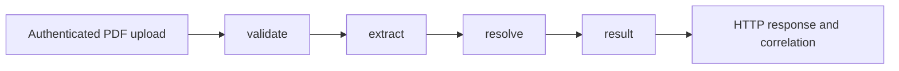

# Testing Capture

The suite follows the current stateless Capture service: a PDF and caller-selected
trade type enter a LangGraph workflow, Azure extracts XML, Diapason MCP resolves
references, and Capture returns a result. It does not exercise Pascal or the old
chat agent.

## Run the tests

From the `ai-capture` root, using the project's Python 3.12 environment:

```bash
uv sync --locked --group dev
uv run --locked --no-sync python -m pytest -v
```

This is the existing CI command. Pytest discovers the new subdirectories without
any CI changes. An activated environment can use `python -m pytest` directly.
No Azure key, MCP service, local `config.json`, or Blob Storage is needed.

Useful selections:

```bash
python -m pytest tests/workflow -v
python -m pytest tests/workflow/test_step_validate.py -v
python -m pytest tests/workflow/test_step_extract.py -v
python -m pytest tests/workflow/test_step_resolve.py -v
python -m pytest tests/workflow/test_step_result.py -v
python -m pytest tests/integrations/test_capture_service.py -v
python -m pytest tests/api tests/configuration tests/observability -v
python -m pytest --collect-only -q
```

`test_step_*.py` names match graph responsibilities, not separate mocked node
implementations. Graph tests invoke the real compiled graph through `run_capture`
or consume `astream(..., stream_mode="updates")`. Async tests use
`pytest.mark.asyncio`; there is no per-test `asyncio.run` wrapper.

## Workflow coverage



| Step | Tests | Behaviors checked |
| --- | --- | --- |
| `validate` | [test_step_validate.py](workflow/test_step_validate.py) | Empty/non-PDF/oversized uploads; exact size boundary; rejection before catalog/model/MCP work; blank/unknown trade types without a fallback; catalog, config, and built-in view/menu precedence. |
| `extract` | [test_step_extract.py](workflow/test_step_extract.py) | Real multipage PDF text and blank pages; textless/corrupt files; missing prompt; empty/missing model choices or messages; model exception; malformed XML; response fences/preamble; full document sent to model while debug preview is limited to 2,000 characters. |
| Trade-type enforcement | [test_trade_type.py](workflow/test_trade_type.py) | Replace or insert the caller-selected type; trim input; handle namespaced/case-varied elements; clear model-generated identifiers; preserve other XML fields; reject blank types and invalid XML. |
| `resolve` | [test_step_resolve.py](workflow/test_step_resolve.py) | Correct Diapason server/tool; exactly `view_entity` and enforced `trade_xml` in the request; 180-second timeout; distinct commercial-paper/lease/loan routing; trace metadata; abort on resolver exception without retry. |
| `result` | [test_step_result.py](workflow/test_step_result.py) | Resolved XML is authoritative; whitespace trimming; populated-field count; missing/blank XML downgrades success; preserve server messages; failure counts zero; warning filtering; debug opt-in; matching integer trace/timing values. |
| Field counting | [test_field_count.py](workflow/test_field_count.py) | Attributes and text; zero/false values; count each populated element once; ignore the root, blank fields, and containers; namespace support; empty/malformed XML returns zero. |
| Graph execution | [test_graph.py](workflow/test_graph.py) | All four node updates in order; prompt/model request and XML handoff; debug request/response consistency; no persistence artifacts; concurrent calls keep trade types, menus, and traces separate. |

The graph tests retain the bundled PDF, catalog, prompt loading, XML handling,
and LangGraph execution. Only the model completion and MCP call are doubles.
Parser-focused cases create small PDFs in memory with `pypdf`; no new binary
fixtures or PDF-generation dependency is introduced.

## Service boundaries and supporting behavior

| Area | Tests | Behaviors checked |
| --- | --- | --- |
| Upload API | [test_extraction.py](api/test_extraction.py) | Canonical and deprecated routes; exact uploaded bytes and trimmed trade type; debug form values; JWT roles/revocation and tenant mismatch; required identity/MCP headers and form fields; disabled service; missing Azure config; error status mapping; client cleanup on success and exceptions; business failure stays HTTP 200; generated/header/form correlation IDs; public response omits internal timings. |
| Metadata and refresh | [test_metadata.py](api/test_metadata.py) | Authenticated catalog/version metadata on both routes; public health; absent chat/UI routes; refresh role; refresh loads from runtime root regardless of working directory and clears cached prompt text. |
| Capture settings | [test_capture_settings.py](configuration/test_capture_settings.py) | `capture` takes precedence, including empty/invalid blocks; legacy `intelligence_contract` fallback; explicit boolean enablement; temperature parsing/default. |
| Catalog | [test_catalog.py](configuration/test_catalog.py) | Representative mappings from every bundled prompt family, including lease menu distinction; default prompt for unknown types; sorted unique metadata; all advertised types load prompts; list/object catalog formats; entry overrides and unknown-type diagnostics. |
| Prompt files/cache | [test_prompts.py](configuration/test_prompts.py) | All bundled prompt paths; missing/empty files and non-object catalogs; path traversal/absolute path rejection; refresh changes catalog/version and cached text; TTL boundaries with a controlled clock; content-derived version; failed JSON refresh preserves the previous usable catalog/cache. |
| Runtime | [test_runtime.py](configuration/test_runtime.py) | Startup uses the service root; no chat session store; Azure constructor arguments, default API version, whitespace normalization, and refusal to construct a client with incomplete settings. |
| MCP identity | [test_mcp_context.py](integrations/test_mcp_context.py) | Real Fernet encryption/decryption of caller credentials; URL normalization, custom headers and label; protocol-version precedence; invalid server URL/key configuration. |
| MCP protocol | [test_mcp_rpc.py](integrations/test_mcp_rpc.py) | Real HTTPX client with `MockTransport`; JSON-RPC envelope, method, arguments, headers and timeout; JSON/SSE/unlabelled JSON responses; structured/nested/text tool payloads; timeout/connection/HTTP/JSON-RPC/tool errors; malformed or missing content. |
| Full offline service | [test_capture_service.py](integrations/test_capture_service.py) | Real multipart HTTP, JWT/Fernet identity, graph, PDF/XML processing, MCP JSON-RPC and response serialization on both routes. Only Azure completion and MCP HTTP transport are replaced. Invalid input/model output, resolver HTTP/tool errors, business failure, and Azure client cleanup are also exercised. |
| Spans and privacy | [test_spans.py](observability/test_spans.py) | In-memory OpenTelemetry export; workflow/stage/model parentage, usage and outcome; success versus unresolved result; exception redaction; no PDF/XML/resolver-message content in spans or logs; incoming HTTP trace parent and identity; LangSmith disabled inside the model worker and restored afterward; ignore invalid usage values. |
| Completion usage | [test_usage.py](observability/test_usage.py) | SDK/dictionary usage formats, alternate field names, computed totals, dictionary zero counts, and absent/nonnumeric usage. |

## Fixtures and isolation

- [conftest.py](conftest.py) gives every test a fresh catalog and prompt cache,
  restoring module globals afterward. Tests do not depend on execution order.
- `service` builds a real ASGI application with temporary JWT keys/revocation
  data, real auth dependencies, a fresh config, and an HTTP `TestClient`.
- `workflow` supplies model/resolver doubles and an async helper around the real
  `run_capture`. Its state and mocks are fresh for each test.
- [integrations/conftest.py](integrations/conftest.py) substitutes HTTPX's MCP
  transport while keeping request serialization and response parsing real.
- Default HTTPX network transports fail unexpected external calls. ASGI and
  explicit `MockTransport` remain usable. LangSmith tracing is disabled by
  default; privacy tests deliberately enable an outer tracing context.
- Prompt TTL tests use a controlled clock rather than sleeps. Concurrent graph
  tests assert independence without depending on thread scheduling or duration.
- Runtime tests restore logging/build-info globals. Span providers always shut
  down through a yielding pytest fixture, including when an assertion fails.

All collected tests are pytest functions. `unittest.TestCase`, class setup, and
manual test runners were removed. `unittest.mock.Mock` and `AsyncMock` remain
only where call assertions or async doubles are useful: pytest itself has no
equivalent built-in mock/spy API, so no `pytest-mock` dependency is needed.

## Deliberate limits and current behavior

These tests check software behavior with deterministic model/MCP responses.
They do not assess model extraction accuracy against a labeled document corpus,
Azure availability, live MCP semantics, OCR, load/performance, or deployment.
The old [container_bootstrap.py](container_bootstrap.py) remains available for
the separately documented manual container check; pytest does not collect it.

Existing behaviors to keep in mind:

- A valid `%PDF-` header does not guarantee a readable PDF. The corrupt-PDF test
  checks that `pypdf` parsing errors stop the graph before model/MCP work. Those
  exceptions are not normalized by the upload handler's `ValueError`/`RuntimeError`
  mapping and can become HTTP 500 responses. Normalizing them is a future
  application change, not included in this test-only rework.
- XML processing checks well-formedness when enforcing the trade type, not a
  Diapason business schema. Result shaping trusts the resolver's success flag
  when it supplies nonempty XML; field counting tolerates malformed XML by
  returning zero.
- Debug output intentionally contains document/model/resolver details when
  requested. Privacy assertions apply to telemetry/logs and default output,
  not to suppressing the explicitly requested debug payload.
- The current catalog allows unknown nonempty trade types through its default
  prompt. Rejection is tested with a catalog that has no default prompt.

See [TEST_CHANGES.md](../TEST_CHANGES.md) for the file-by-file migration, measured
coverage, verification commands, and removed legacy checks.
